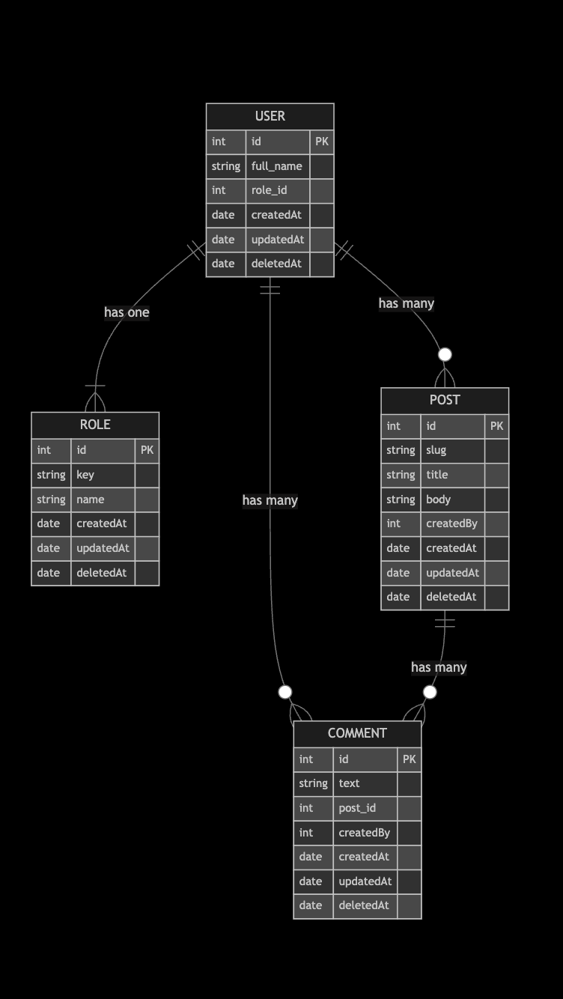

# drvn Challange

## Hi!!! Thanks for checking out my code.

### Data Model

### First Time Setup

1. `cp .env.example .env`
2. `composer install`
3. `php artisan key:generate`
4. `php artisan migrate:fresh --seed`

If u need a DB, in the repo already exists a docker compose file to run a mariadb. This docker compsoe take the database settings from the .env file so take that in mind.

### Running the tests

`php artisan test`

### Running the server

`php artisan serve`

### Running the seeder

`php artisan db:seed`

### Running the migrations

`php artisan migrate`

### Running the migrations fresh

`php artisan migrate:fresh`

## postman-collection contiene la coleccion de postman con los edpoints (y ejemplos de los bodys

## NOTAS AL PASO 

- En el composer agrege al autoload  un archivo de utilidades, esto es algo que hago para principalmente no tener que re escribir cosas tediosas, y principalmente, para evitar errores falsos de intelephense 

- Le meti una mini pipe de CI en github actions para ver que los tests pasen. 

- El sistema de respuestas esta echo para manejar colleciones , items y respuestas de manera estandarizada.

- Como patrones de diseño, principalmente, uso lo que propone laravel, y me baso mucho en el principio tell don't ask.

- Decidi no usar repositorios, yo entiendo a eloquent como un repositorio, a parte de ser un ORM.

- Tema testing, decidi solamente testear flujos completos (mas tipo feature que unit) , mas que nada para demostrar conocimiento, por que si le daba cobertura individual a servicios, controladores y utilidades, se me iba de tiempo.

- Tambien docker compose para levantar la base de datos, laravel en si no dockerize ya que en local desarrollo con herd y no me hacia falta esa parte de entorno.

- Casi llegando a terminar el challange me di cuenta que el nombre del Post y PostComment no eran los mas adecuados, deberia haber sido Article y ArticleComment 😅

- En la respuesta generales hay una parte Meta que no tiene uso, mas adelante si sumara spatie ahi iria todo lo q se permite filtrar etc etc

- El response de Posts quedo medio grande agregando por defecto los comentarios, se deberia implementar un lazy load, o implementar spatie query builder para cargarlo explicitamente. (Por tiempo no lo hice)

